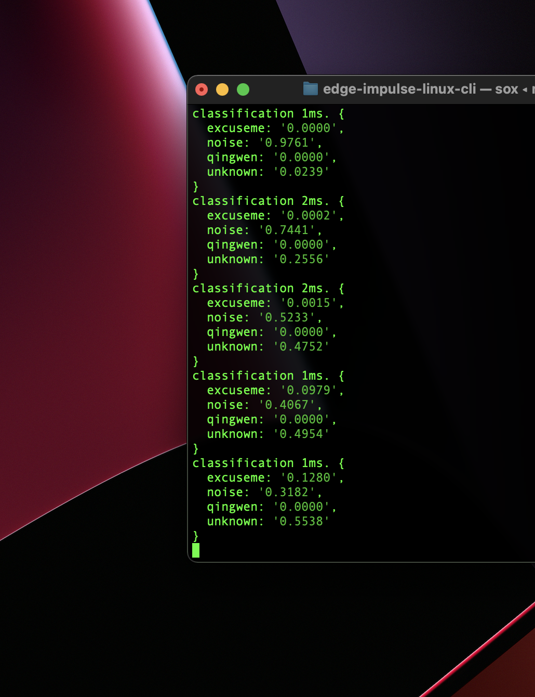
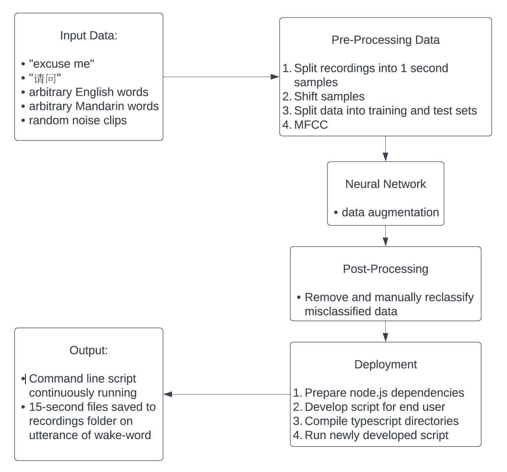
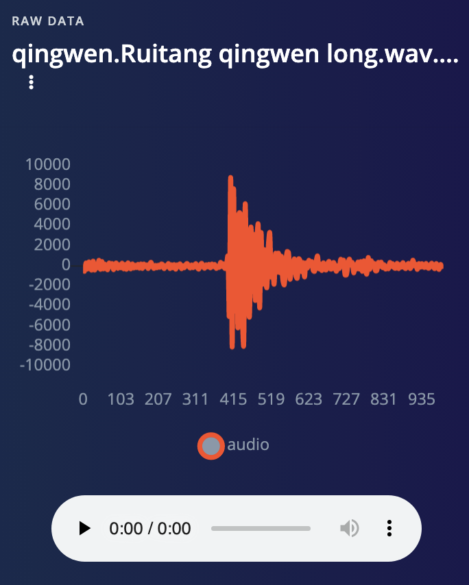
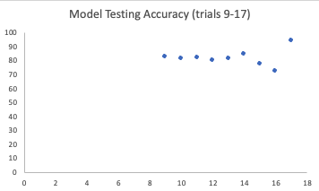
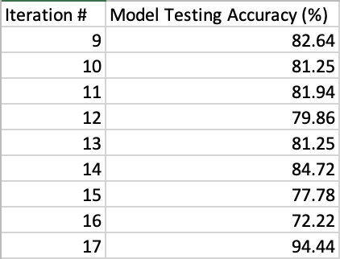

# Auto Idiom

## Introduction

Auto Idiom listens for a wake word either in English (excuse me) or Mandarin Chinese (请问) and upon hearing it, records 15 seconds of audio and saves it to a designated folder on the laptop.

I am currently studying Mandarin Chinese, and one approach that I found highly useful is language exchange: speaking with a fluent Mandarin speaker solely in Mandarin for a few minutes before switching to English and speaking solely in English for a few minutes. However, when practicing langauge exchange, there are often unfamiliar words and idioms that get expressed, and stopping to write down the meanings of these new terms interrupts the flow of conversation. Auto Idiom's goal is to automate this process to help the conversation flow more smoothly.

Wakeword recognisers are already in widespread use in consumer electronics: Apple's Siri, the Google Assistant, and Amazon's Alexa all use a wakeword recogniser to recognise when to start a speech recognition algorithm (which requires considerably more computational resources than wakeword recognition).

Multilingual speech processing is currently an active area of research: researchers at Harvard's Edge Computing Lab developed a keyword spotter that recognised 440 keywords in 22 different langauges with 87.4% accuracy (Mazumder et al. 2021).

My goal was to expand on this work through enabling live deployment and actuating a useful function via the word recognition.

## Research Question

 Auto Idiom prods the question of if wake-word recognition differs in live deployment performance depending on language. Specifically, it examines how well wake word recognisers can perform when applied to the most widely-spoken tonal language, Mandarin Chinese.

## Application Overview

The Auto-Idiom application breaks down into six building block components:

1. Collecting input data
2. Pre-processing of collected data
3. Development of a classification neural network
4. Post-processing of data after observing the results of the neural network
5. Development of a Node.js application and integration of the neural network
6. Deployment of the newly developed application on a user's computer.

Once data was collected, it could be processed in Edge Impulse by breaking down the samples into one second segments, and splitting 80% of the data into a training set and 20% into a test set. Recordings are additionally transformed using the Mel Frequency Cepstral Coefficient.

This data is then inputted to the neural network model, in which certain parameters are adjusted, but it remains mostly a black box.

After this stage, data is post-processed to reclassify misclassifed test samples, moving them into the training set.

After retraining, the model can be exported as an eim file, and referenced from a custom `node.js` application.

The `node.js` application can be ran from the command line, and it will save 15 seconds recordings into a `recordings` folder when either the Mandarin or English wake word is spoken.

## Data

I used five different data types in training this model:

1. different speakers saying "excuse me"
2. different speakers saying "请问"
3. arbitrary words in English (classified as unknown)
4. arbitrary speech clips in Mandarin (also classified as unknown)
5. random noise clips (e.g. from household appliances)

Data of the first type consisted primarily of recordings of myself saying "excuse me", but also included a few recordings of other speakers of both genders.

"请问" data included came from 5 different native Mandarin speakers, repeating the wakeword for between 1 and 3 minutes per person.

The third and fifth data types were sourced from Edge Impulse's pre-built keyword spotting dataset (Edge Impulse 2022).

Lastly, the fourth data type was sourced from recording a few minutes of a few different Mandarin language podcasts.

The datasets next needed to be split into 1 second samples. To make the model more robust, samples were randomly shifted (i.e. "excuse me" snippets sometimes occurred at the beginning and end of the one-second-recordings, in addition to the middle).

After several trial-and-error attempts, I found the upper limit of total data that Edge Impulse could handle without crashing was around 13 minutes. Thus, I decided to consolidate data types 3 and 4 into one category, so that more data could be included from data types 1 and 2 (given that it would be ideal to have an equal amount of data in each category).

Data was split into a standard 80% training, 20% testing split.

## Model

Recordings were processed using the Mel Frequency Cepstral Coefficients signal processing method; this was used because of its specialty in handling speech (Edge Impulse, 2022).

From inspecting the Feature Explorer in Edge Impulse, the data generally grouped itself neatly according to data type, so no changes needed to be made to the MFCC portion of the model.

For the neural network architecture itself, I started with the 1D Convolutional architecture, and it produced satisfactory results over the course of my experiments. This was unsurprising: 1D Convolutional Neural Networks is frequently used for different audio classification tasks, including environmental sound classification tasks (Abdoli, Cardinal, and Koerich 2019). At the 14th iteration, for example, "excuse me" and "请问" were classified correctly during model testing in 91.2% and 100% of samples, respectively.

I was also interested to see how this compares to a 2D Convolutional Neural Network-based architecture: Oglic et al. (2020) found this style of architecture to produce superior results. However, I continued to get inferior results through manual tuning of the parameters under this architecture.

## Experiments

1. Finding Edge Impulse unhandle the data volume that I initially collected (approximately 12 minutes of each data type), I reduced my datasets down to 200 samples (and roughly 3 and a half minutes) each. This trial had an extremely high accuracy, at 92.2% overall, and the English and Mandarin wake words having accuracies of 100% and 94.7%, respectively.
2. Noticing the incredibly high accuracy under the default configuration, I added data augmentation: specifically, I set the three adjustable augmentation parameters (noise, masked time bands, frequency bands) to high. The performance remained at a similar level.
3. Due to the suspiciously high accuracy levels, I added back more data, but this resulted in data from the "unknown" category being misclassified as the Mandarin wake word in 10% of dialogue, which I viewed as unacceptable performance in the deployment application.
4. To reduce the false positive rate, I expanded the number of recordings used to train the Mandarin wake word, by adding 3 minutes of recordings from another Mandarin speaker. Unfortunately, this was too much data for Edge Impulse to process.
5. In this iteration, I attempted to fix the error by reducing the amount of Mandarin podcast data to the first half. However, Edge Impulse was still producing an Out of Memory error.
6. I removed all Mandarin podcast data as an attempt to assess the memory limit at which Edge Impulse would cease to function, evaluating that the limit appeared to be around 13 minutes of audio data.
7. In this iteration, I explored the possibility of using two models in parallel, each with one wake word. To accomplish this, I set up a new Edge Impulse project, [EXCUSEME-MIN](https://studio.edgeimpulse.com/studio/87685).
8. At the 8th iteration, I resampled the data that I was previously sampling for iterations 1-6, but I collected a less concentrated sample by specifically collecting 1 minute of each Mandarin "请问" speaker, with other randomisation methods performed to collect samples of the Mandarin podcasts and of the noise samples.
9. In this iteration, I reclassified wrong samples and moved them to the training set. This resulted in overfitting.
10. I reduced the learning rate to 0.0025 from 0.005 to reduce overfitting. N.B. this was the initial iteration I used for deployment.
11. I tested out autobalancing (but found it ineffectual and reverted).
12. Added in data augmentation: noise low, masked time bands low.
13. Increased training cycles to 200, but this overfit
14. Increased augmentation to high to combat overfitting
15. Tested out 2D convolutional network architecture with default settings
16. Reduced cycle count back to 100.
17. Tested out parameters suggested by EON tuner for comparison

## Results and Observations

I found that Edge Impulse, while a very good tool for rapidly deploying a deep learning model, has opaque restrictions regarding the amount of data that one can use to train the model. As can be seen from my experiments, much of trials 1 - 8 solely involve attempting to find the data limit of Edge Impulse, and how best to make use of the available memory when I found the limit to be 13 minutes.

In iteration 6, I explored the possibility of setting up two separate models that each had only one wake word, which could be run concurrently by the node.js application. This would in turn allow more data to be used in the training of the models, by being able to replace one of the wake word's quantities of data with more data from the other categories. I thus stratified the "unknown" data by language (English versus Mandarin). This allowed more unknown data to be incorporated, but the confusion between Mandarin unknown audio and English unknown audio was high enough that I discounted this approach as not worthwhile.

To get around the limitations of Edge Impulse, I would perhaps run a restricted dataset through Edge Impulse. I would then note the EON tuner's model parameters (due to the high model accuracy I achieved when using them) and use them as initial conditions for training a TinyML model.

Lastly, it would be worth assessing how to make the interface more user-friendly. The command-line interface would serve as a major barrier to usability, and it might be the case that a different interface, e.g. a microcontroller in a language classroom, could allow the programme to run with less setup required on the part of the end-user.

## Bibliography

Abdoli, S., Cardinal, P., Lameiras Koerich, A., 2019. End-to-end environmental sound classification using a 1D convolutional neural network. Expert Systems with Applications 136, 252–263. https://doi.org/10.1016/j.eswa.2019.06.040

Keyword spotting [WWW Document], n.d. URL https://docs.edgeimpulse.com/docs/pre-built-datasets/keyword-spotting (accessed 4.27.22).

Mazumder, M., Banbury, C., Meyer, J., Warden, P., Reddi, V.J., 2021. Few-Shot Keyword Spotting in Any Language. Interspeech 2021 4214–4218. https://doi.org/10.21437/Interspeech.2021-1966

Oglic, D., Cvetkovic, Z., Bell, P., Renals, S., 2020. A Deep 2D Convolutional Network for Waveform-Based Speech Recognition, in: Interspeech 2020. Presented at the Interspeech 2020, ISCA, pp. 1654–1658. https://doi.org/10.21437/Interspeech.2020-1870

Responding to your voice [WWW Document], n.d. URL https://docs.edgeimpulse.com/docs/tutorials/responding-to-your-voice (accessed 4.27.22).

## Declaration of Authorship

I, August Weinbren, confirm that the work presented in this assessment is my own. Where information has been derived from other sources, I confirm that this has been indicated in the work.

August Weinbren

28/04/22
